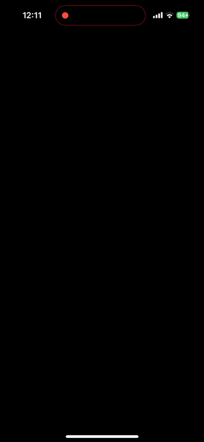

# The Proof of Concept app for bantopia

It's linked to the website's API using Django.

It's message functional on iOS, but I have yet to add @mentions and logins from the main site.

(Built with my own custom version of Godot that has a few changes to the way it handles iOS keyboards to make it work properly smoothly, if you need them feel free to ask)

Reasons for using Godot:
- Custom shaders for color invert effect
- Physics for the chatbox
- I wanted to try out a game engine

# Showcase
Two gifs from old testing screen records. (Thank God they were found)

## Fun Physics

- I used hookes law to make a nifty sending swipe.
- I wanted the site to feel natural.

## Warning

- All the cool games have epilepsy warnings.
- Gif is 1.5x speed.
- See "craziness" below

## Craziness

- I used made a custom shader to produce the difference effect.
- It was inspired by the blackbox mobile app and the "difference css effect".
